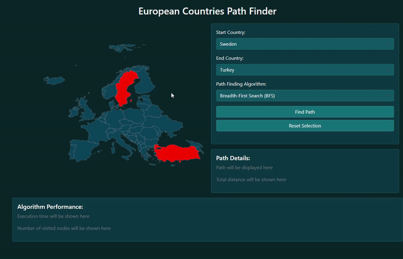

# 🌍 European Capitals Pathfinder

A C# project (Visual Studio 2022) that visualizes and compares **BFS** and **A\*** algorithms for finding routes between European capitals.

## 🧠 Description
This application allows the user to:
- Select two European countries directly on an interactive SVG map
- Calculate the shortest path between their capitals
- Display the route visually
- Measure performance (execution time, nodes explored, total distance)

## ⚙️ Features
- BFS (Breadth-First Search)  
- A* Search with heuristic  
- Interactive SVG map integration  
- Path visualization  
- Performance metrics: time, nodes explored, distance  

## 🛠️ Technologies
- C# (.NET, Visual Studio 2022)  
- Windows Forms / WPF  
- Stopwatch for execution time  
- SVG rendering for map 

### 📊 Algorithm Examples

**BFS Example:**  
Path Details:  
Romania (Bucharest) → Hungary (Budapest) → Austria (Vienna) → Germany (Berlin) → France (Paris) → Spain (Madrid) → Portugal (Lisbon)  

Total Distance: 3814 km  
Algorithm Performance:  
Execution Time: 0.37 ms  
Nodes Visited: 44  

**A* Example:**  
Path Details:  
Romania (Bucharest) → Hungary (Budapest) → Austria (Vienna) → Switzerland (Bern) → France (Paris) → Spain (Madrid) → Portugal (Lisbon)  

Total Distance: 3531 km  
Algorithm Performance:  
Execution Time: 3.96 ms  
Nodes Visited: 19  

## ✅ Conclusion
This project demonstrates how different pathfinding algorithms, BFS and A*, perform when finding routes between European capitals. It highlights differences in path efficiency, number of nodes explored, and execution time, providing a clear visual and quantitative comparison. The application can be used for educational purposes or as a base for further route optimization projects.
